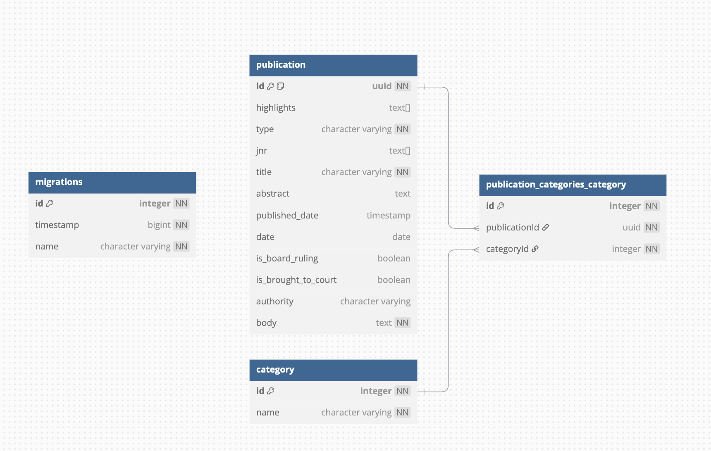

# Pandektes Task

## Overview

This is a service that integrates with the **Miljø- og Fødevareklagenævnet (MFKN) case law database**. The application scrapes and stores case law information and provides an endpoint to retrieve publications by ID.

## Running the Service

This project uses **Docker** for containerization. To start the service, follow these steps:  
**Build and start the containers**

```sh
docker-compose up --build -d
```

**Start the service**

```sh
docker-compose up -d
```

The service will now be running and ready to process requests.

## API

1. POST Categories and publications endpoint:

```curl
curl --request POST \
  --url 'http://127.0.0.1:3000/publication/populate?size=100&skip=0'
```

**Query Parameters:**

- size: This specifies the number of publications to be populated or fetched in the response.

- skip: This is used for pagination. It indicates the number of records to skip before returning the data. A value of 0 means no records are skipped, and the request will return the first size number of records.

2. GET publication and category by publication ID endpoint:

```curl
curl --request GET \
  --url http://127.0.0.1:3000/publication/0ab2afdf-9f70-4eda-ba8c-287495bca341
```

## Database schema



## What is Not Included

The following features are **not** included in the current version of the service:

1. **Authentication (Auth)**  
   The service does not include any authentication or authorization mechanisms. All endpoints are publicly accessible without requiring user login or validation.

2. **Testing**  
   The current version does not include any automated tests, such as unit tests or integration tests, to ensure the correctness of the service. Testing should be added in future versions for better reliability.

3. **Performance Improvements**  
   Optimizations for performance, such as caching, query optimization etc, are not included in the current version. These improvements will be addressed as the service scales.
